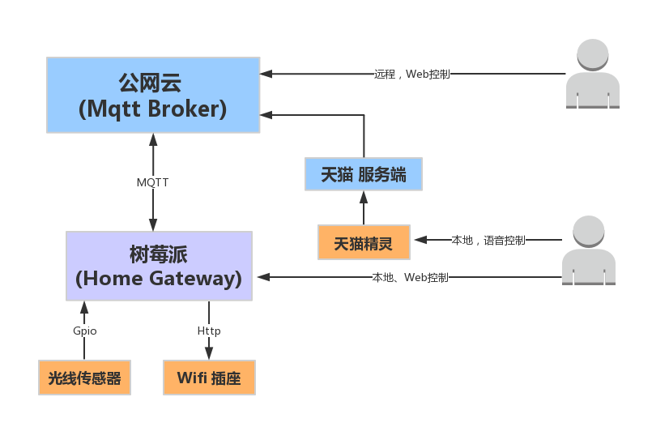

## Home Gateway [English](doc/readme_en.md)

这是一个运行在树莓派上的网关，用于智能家居控制。

#### 系统架构 

#### 本地控制

#### 远程控制

#### 联动场景
raspberry  
with a light sensor in raspberry digital IO input

### USAGE
it used in bedroom when you are going sleep but the top light swich is far from the bed.   
when closing the top light, the light sensor catch it, the raspberry will send http method to esp8266 to turn on another samll light, and after a few seconds turn off it   
